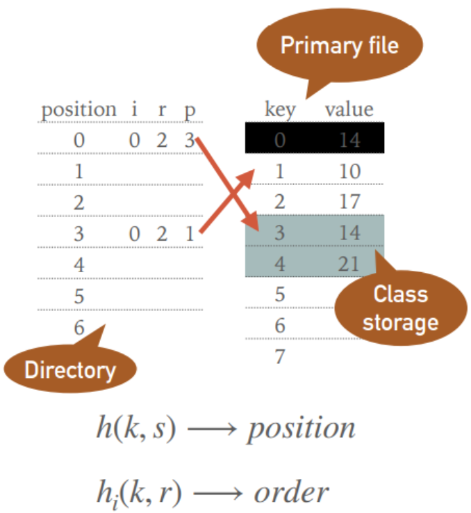

# NDBI007 Individual programming task

Graphical simulator of Cormack's perfect static hashing method, implemented
as an individual programming task for Principles of Data Organisation
(winter semester 2023/24). The simulator should help to understand the principle of the hashing method. Each insertion of a new value is presented as a step-by-step solution.

## Running the application

There are (at least) two ways to run this project. First, you
need to download the project sources. Then:

1. The simpler option is to open the project in an Integrated Development
   Environment (IDE), such as **IntelliJ IDEA** or Eclipse. (I only tested
   it in IntelliJ IDEA). Make sure that your IDE is configured to use **JDK 11**,
   open the Main class and run it.
2. Or you can use Apache Maven and run the project with it. You must
   Maven and java installed. To make sure you have JDK 11, you can type `java -version`
   in your terminal. A pom.xml is already configured.
   You only need to run the Maven project as follows (in the Linux terminal):
    ```bash
    mvn clean
    mvn install
    mvn exec:java
    ```

## To use the app

After you have executed the app, a window appears. You will see an empty directory, an empty
primary file and bottom bar in which you can enter a new value. If you are not sure about 
Cormack hashing, parameters, etc., you can click on the Info button. Try inserting more
values (14, 17, 10, 21, 28, 42) and see what happens.

## About Cormack Hashing

Cormack hashing is a perfect static hashing method based on divide and conquer. First, 
the set of all data records (values) to be hashed is divided into smaller subsets. The primary
(initial) hash function is responsible for this. Here we have set the directory for subsets to size 7. Then we need to find the perfect secondary hash function for each small
subset of records independently. We set the position in the directory with the primary 
hash function and then order the colliding subset with the secondary hash function.

Parameters
- s = 7 fixed size of the directory
- p = pointer to the primary file in which the first value of the subset is stored
- i = index of the perfect hash function to be used
- r = number of colliding data records in the primary file
- k = value to be inserted or colliding value

Functions
- **primary (initial) hash function:** h(k,s) = k mod s
- **secondary hash function:** h<sub>i</sub>(k,r) = (k >> i) mod r
   - if we get collisions we increase i by 1, if we still get 
     collisions for each i, we increase r by 1 (and
     count again from i = 0)

A summarized picture of what is going on (thanks to the NDBI007 practicals teacher):

